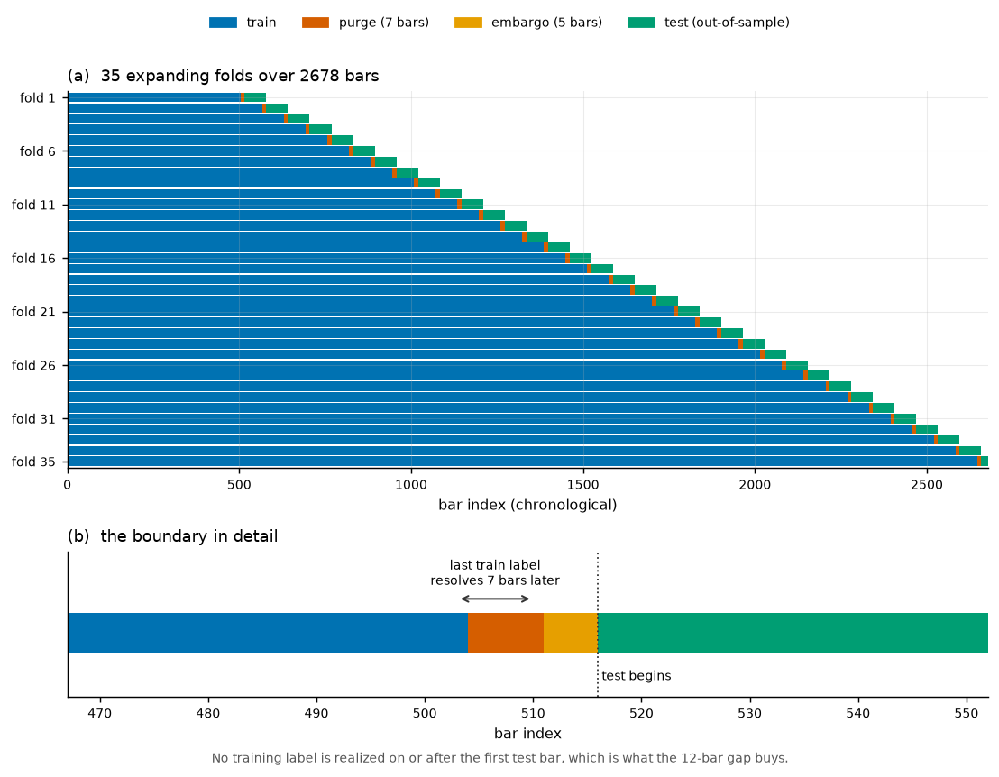
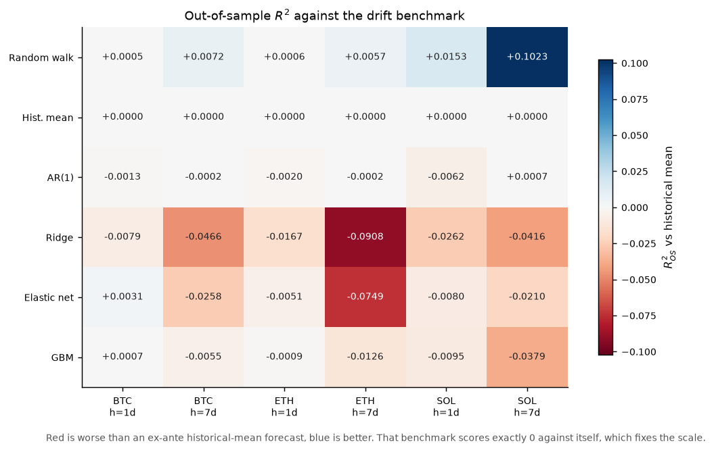
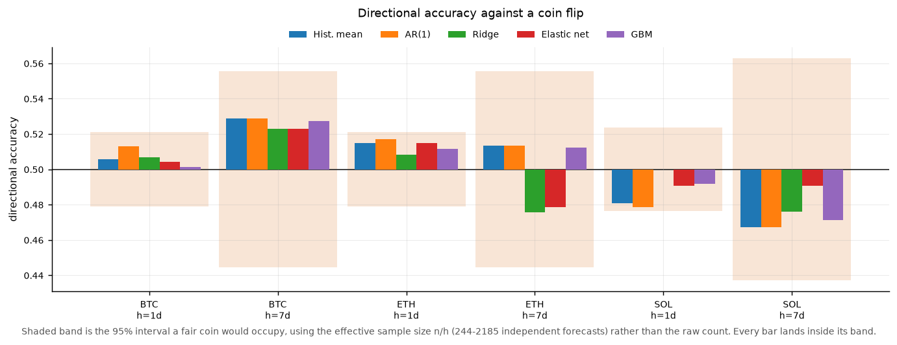
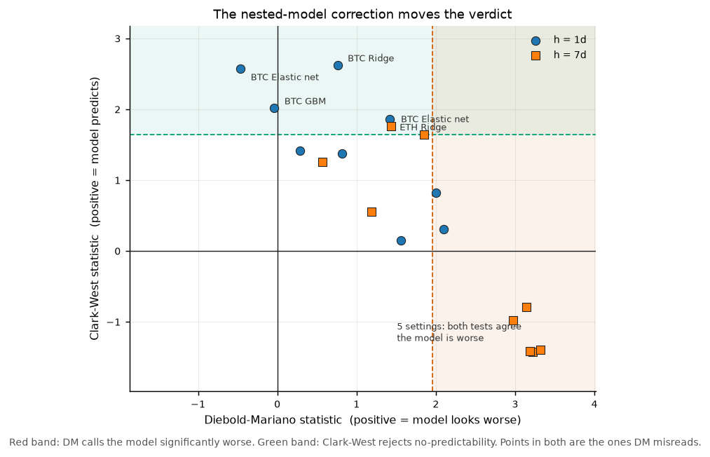
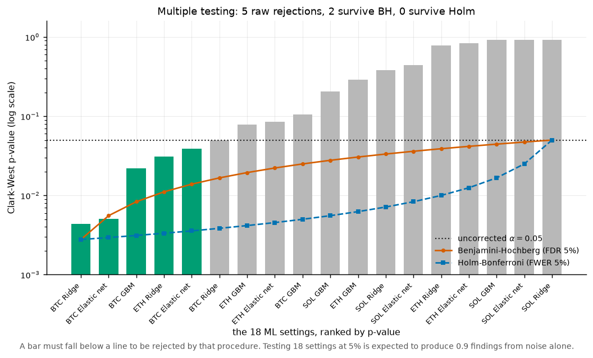
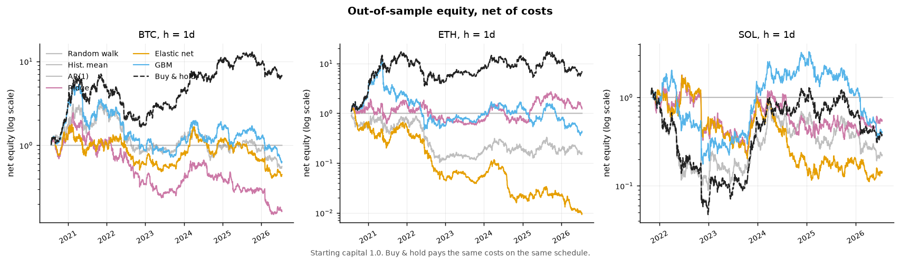
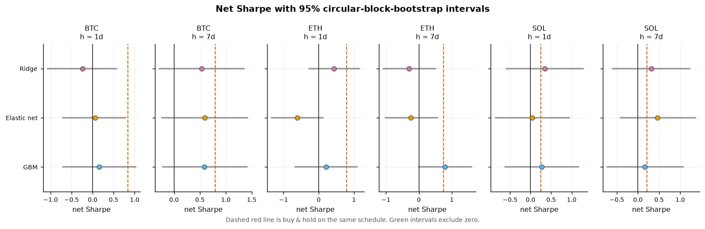
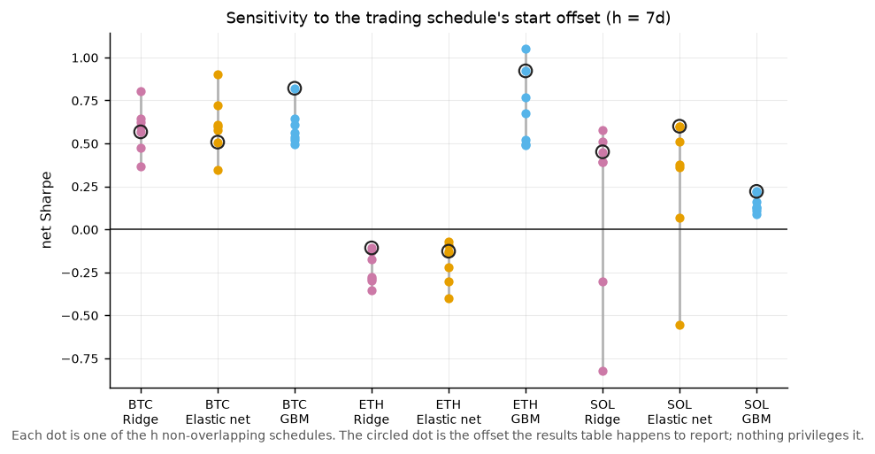

# Out-of-sample results

_Generated by `make backtest` on 2026-08-04. Do not edit by hand._

**Study.** Assets BTC, ETH, SOL; horizons 1d, 7d; data from 2019-01-01 to 2026-07-18. Walk-forward: expanding, train 504d / test 63d, embargo 5d, so the evaluated out-of-sample window is **2020-07-23 → 2026-07-16**. Costs: 17 bps per side.

## Headline: does anything beat the random walk?

- Of **18** ML (model x asset x horizon) settings, **0** beat the random walk on squared error at p<0.05 (Diebold-Mariano), and **7** were significantly *worse* than it. But DM is the wrong test here: the random walk is *nested* in every one of these models, which biases DM toward the benchmark.
- Under Clark-West, which corrects that bias, **5** of 18 reject the no-predictability null at an uncorrected p<0.05, against **0.9** expected by chance at that threshold across 18 tests. Adjusting for the size of the search, **0** survive Holm-Bonferroni (family-wise 5%) and **2** survive Benjamini-Hochberg (5% false-discovery rate).
- **0** showed significant sign-timing skill at p<0.05 (Pesaran-Timmermann), the property a directional strategy actually trades on.
- After costs, **0** ML strategies had a net Sharpe whose 95% bootstrap CI excluded zero, and **5** out-Sharpe simply holding the asset on the same schedule and costs, on the point estimate, which is the weakest form of that claim.
- Best deflated Sharpe (deflating for the 6-model race run within each asset-horizon): **0.85** (historical_mean, BTC, h=7d, 1 position changes).

### Reading the statistics and the PnL together

- Surviving Benjamini-Hochberg: ridge on BTC h=1d (R²_oos -0.0079, net Sharpe -0.23, 95% CI [-1.07, 0.56]); elastic_net on BTC h=1d (R²_oos 0.0031, net Sharpe 0.06, 95% CI [-0.70, 0.79]).
- Note that one of these has a *negative* out-of-sample R² against the drift benchmark. That is not a contradiction: Clark-West tests whether the population mean squared error is lower, which a model can achieve while its own estimation noise leaves the realized forecast worse than a constant. It is evidence of a weak signal, not of a usable forecast.
- Crucially, **no setting is in both groups**: the settings that pass the corrected statistical test are not the ones that make money, and vice versa. Two unrelated sets of winners drawn from the same search is the signature of noise, not of an edge.

## Forecast accuracy & market timing

Every test is shown as **statistic (p-value)**, because the sign is the half that matters: a model that is significantly *worse* than the benchmark produces the same small p as one that is better.

- `R²_oos` — Campbell-Thompson out-of-sample R² against the `historical_mean` forecast. Negative means the model loses to an ex-ante drift estimate.
- `DM` — Diebold-Mariano, two-sided. **Negative favours the model** (lower squared error than the random walk).
- `CW` — Clark-West, one-sided, valid for the nested comparison DM is not. **Positive favours the model.**
- `CW p adj` — that same p-value after Holm-Bonferroni and Benjamini-Hochberg correction over all ML settings in the study, shown as `holm / BH`. This is the column to read: the raw one has been mined across every model, asset, and horizon here.
- `PT` — Pesaran-Timmermann, two-sided. **Positive means sign-timing skill**; negative means the forecast is reliably wrong-way.

**BTC · h=1d**

| model | RMSE | R²_oos | DirAcc | RankIC | DM (p) | CW (p) | CW p adj | PT (p) |
| --- | --- | --- | --- | --- | --- | --- | --- | --- |
| random_walk | 0.0301 | 0.0005 | — | — | — | — | — / — | — |
| historical_mean | 0.0301 | 0.0000 | 0.506 | 0.002 | +0.18 (0.860) | +1.03 (0.152) | — / — | — |
| ar1 | 0.0301 | -0.0013 | 0.513 | 0.033 | +0.34 (0.737) | +1.24 (0.107) | — / — | +1.23 (0.217) |
| ridge | 0.0302 | -0.0079 | 0.507 | 0.049 | +0.76 (0.447) | +2.62 (0.004) | 0.079 / 0.046 | +0.54 (0.591) |
| elastic_net | 0.0301 | 0.0031 | 0.504 | 0.046 | -0.46 (0.644) | +2.57 (0.005) | 0.087 / 0.046 | +0.23 (0.817) |
| gbm | 0.0301 | 0.0007 | 0.501 | 0.019 | -0.04 (0.970) | +2.02 (0.022) | 0.350 / 0.131 | -0.39 (0.698) |

**BTC · h=7d**

| model | RMSE | R²_oos | DirAcc | RankIC | DM (p) | CW (p) | CW p adj | PT (p) |
| --- | --- | --- | --- | --- | --- | --- | --- | --- |
| random_walk | 0.0804 | 0.0072 | — | — | — | — | — / — | — |
| historical_mean | 0.0807 | 0.0000 | 0.529 | -0.018 | +0.40 (0.686) | +1.01 (0.156) | — / — | — |
| ar1 | 0.0807 | -0.0002 | 0.529 | -0.023 | +0.42 (0.675) | +1.00 (0.159) | — / — | — |
| ridge | 0.0825 | -0.0466 | 0.523 | 0.044 | +1.85 (0.064) | +1.64 (0.050) | 0.651 / 0.150 | +0.54 (0.596) |
| elastic_net | 0.0817 | -0.0258 | 0.523 | 0.043 | +1.43 (0.152) | +1.76 (0.039) | 0.546 / 0.140 | +0.47 (0.633) |
| gbm | 0.0809 | -0.0055 | 0.527 | 0.032 | +0.57 (0.569) | +1.25 (0.105) | 1.000 / 0.210 | +0.28 (0.723) |

**ETH · h=1d**

| model | RMSE | R²_oos | DirAcc | RankIC | DM (p) | CW (p) | CW p adj | PT (p) |
| --- | --- | --- | --- | --- | --- | --- | --- | --- |
| random_walk | 0.0407 | 0.0006 | — | — | — | — | — / — | — |
| historical_mean | 0.0408 | 0.0000 | 0.515 | 0.019 | +0.25 (0.806) | +0.81 (0.210) | — / — | — |
| ar1 | 0.0408 | -0.0020 | 0.517 | 0.036 | +0.47 (0.639) | +1.16 (0.124) | — / — | +0.95 (0.345) |
| ridge | 0.0411 | -0.0167 | 0.508 | 0.053 | +1.42 (0.157) | +1.86 (0.031) | 0.468 / 0.140 | +0.52 (0.600) |
| elastic_net | 0.0409 | -0.0051 | 0.515 | 0.040 | +0.82 (0.413) | +1.37 (0.085) | 0.939 / 0.192 | +1.00 (0.315) |
| gbm | 0.0408 | -0.0009 | 0.512 | 0.021 | +0.29 (0.775) | +1.42 (0.078) | 0.937 / 0.192 | -0.30 (0.762) |

**ETH · h=7d**

| model | RMSE | R²_oos | DirAcc | RankIC | DM (p) | CW (p) | CW p adj | PT (p) |
| --- | --- | --- | --- | --- | --- | --- | --- | --- |
| random_walk | 0.1073 | 0.0057 | — | — | — | — | — / — | — |
| historical_mean | 0.1076 | 0.0000 | 0.514 | 0.039 | +0.39 (0.696) | +0.88 (0.188) | — / — | — |
| ar1 | 0.1076 | -0.0002 | 0.514 | 0.034 | +0.41 (0.685) | +0.87 (0.191) | — / — | — |
| ridge | 0.1124 | -0.0908 | 0.476 | -0.047 | +3.15 (0.002) | -0.79 (0.786) | 1.000 / 0.923 | -1.27 (0.265) |
| elastic_net | 0.1115 | -0.0749 | 0.479 | -0.052 | +2.98 (0.003) | -0.98 (0.837) | 1.000 / 0.923 | -1.28 (0.242) |
| gbm | 0.1083 | -0.0126 | 0.512 | -0.042 | +1.19 (0.234) | +0.55 (0.292) | 1.000 / 0.478 | +0.09 (0.403) |

**SOL · h=1d**

| model | RMSE | R²_oos | DirAcc | RankIC | DM (p) | CW (p) | CW p adj | PT (p) |
| --- | --- | --- | --- | --- | --- | --- | --- | --- |
| random_walk | 0.0499 | 0.0153 | — | — | — | — | — / — | — |
| historical_mean | 0.0502 | 0.0000 | 0.481 | -0.029 | +3.00 (0.003) | -1.23 (0.891) | — / — | — |
| ar1 | 0.0504 | -0.0062 | 0.478 | -0.007 | +2.39 (0.017) | -0.77 (0.779) | — / — | -0.81 (0.418) |
| ridge | 0.0509 | -0.0262 | 0.500 | 0.010 | +2.10 (0.036) | +0.31 (0.379) | 1.000 / 0.568 | +0.01 (0.996) |
| elastic_net | 0.0504 | -0.0080 | 0.491 | 0.013 | +1.56 (0.119) | +0.15 (0.441) | 1.000 / 0.611 | -0.66 (0.506) |
| gbm | 0.0505 | -0.0095 | 0.492 | 0.023 | +2.00 (0.046) | +0.82 (0.207) | 1.000 / 0.372 | +0.57 (0.569) |

**SOL · h=7d**

| model | RMSE | R²_oos | DirAcc | RankIC | DM (p) | CW (p) | CW p adj | PT (p) |
| --- | --- | --- | --- | --- | --- | --- | --- | --- |
| random_walk | 0.1346 | 0.1023 | — | — | — | — | — / — | — |
| historical_mean | 0.1420 | 0.0000 | 0.467 | -0.103 | +3.63 (0.000) | -1.74 (0.959) | — / — | — |
| ar1 | 0.1420 | 0.0007 | 0.467 | -0.099 | +3.62 (0.000) | -1.71 (0.957) | — / — | — |
| ridge | 0.1449 | -0.0416 | 0.476 | -0.039 | +3.22 (0.001) | -1.43 (0.923) | 1.000 / 0.923 | -0.67 (0.604) |
| elastic_net | 0.1435 | -0.0210 | 0.491 | -0.034 | +3.19 (0.001) | -1.41 (0.921) | 1.000 / 0.923 | -0.19 (0.504) |
| gbm | 0.1447 | -0.0379 | 0.471 | -0.081 | +3.32 (0.001) | -1.39 (0.918) | 1.000 / 0.923 | -0.18 (0.680) |

## Net-of-cost trading performance

Sign strategy on a non-overlapping h-day schedule, after 17 bps/side, against an always-long reference on the same schedule and costs, the line any long-biased forecaster has to clear before its Sharpe means anything.

- `Sharpe` is annualized at 365/h with a 95% circular-block-bootstrap CI.
- `Phases` spans the h possible start offsets of the sampling schedule; a signal that only works on one offset is an artifact.
- `PSR`/`DSR` are the probabilistic and deflated Sharpe ratios. DSR deflates for the models raced *within* each asset-horizon, which understates the real search: a reader picking the best cell in this document is choosing among all 42 rows, plus the feature set, horizons, and cost level that were fixed before any of it ran. Treat DSR here as an upper bound.
- Drawdowns are deep across the board because a unit-leverage daily-flipping position on ~70% annualized volatility carries a large variance drag; that is a property of the position sizing, not of any one model.

**BTC · h=1d**

| model | Sharpe (net) | 95% CI | Phases | MaxDD | PSR | DSR | changes |
| --- | --- | --- | --- | --- | --- | --- | --- |
| random_walk | 0.00 | [0.00, 0.00] | — | 0.00% | — | — | 0 |
| historical_mean | 0.84 | [0.02, 1.68] | — | -76.63% | 0.98 | 0.82 | 1 |
| ar1 | 0.12 | [-0.67, 0.90] | — | -83.23% | 0.61 | 0.20 | 486 |
| ridge | -0.23 | [-1.07, 0.56] | — | -93.90% | 0.28 | 0.04 | 496 |
| elastic_net | 0.06 | [-0.70, 0.79] | — | -77.21% | 0.56 | 0.16 | 538 |
| gbm | 0.16 | [-0.70, 1.02] | — | -88.49% | 0.65 | 0.22 | 207 |
| buy_and_hold | 0.84 | [0.02, 1.68] | — | -76.63% | 0.98 | — | 1 |

**BTC · h=7d**

| model | Sharpe (net) | 95% CI | Phases | MaxDD | PSR | DSR | changes |
| --- | --- | --- | --- | --- | --- | --- | --- |
| random_walk | 0.00 | [0.00, 0.00] | [0.00, 0.00] | 0.00% | — | — | 0 |
| historical_mean | 0.80 | [-0.01, 1.64] | [0.78, 0.80] | -76.63% | 0.97 | 0.85 | 1 |
| ar1 | 0.80 | [-0.01, 1.64] | [0.78, 0.80] | -76.63% | 0.97 | 0.85 | 1 |
| ridge | 0.53 | [-0.28, 1.35] | [0.37, 0.80] | -67.47% | 0.90 | 0.64 | 642 |
| elastic_net | 0.59 | [-0.23, 1.42] | [0.35, 0.90] | -65.29% | 0.93 | 0.70 | 569 |
| gbm | 0.58 | [-0.21, 1.41] | [0.50, 0.82] | -73.98% | 0.92 | 0.69 | 161 |
| buy_and_hold | 0.80 | [-0.01, 1.64] | — | -76.63% | 0.97 | — | 1 |

**ETH · h=1d**

| model | Sharpe (net) | 95% CI | Phases | MaxDD | PSR | DSR | changes |
| --- | --- | --- | --- | --- | --- | --- | --- |
| random_walk | 0.00 | [0.00, 0.00] | — | 0.00% | — | — | 0 |
| historical_mean | 0.80 | [-0.01, 1.60] | — | -79.35% | 0.97 | 0.67 | 1 |
| ar1 | 0.00 | [-0.68, 0.69] | — | -89.76% | 0.50 | 0.07 | 665 |
| ridge | 0.43 | [-0.27, 1.16] | — | -69.75% | 0.86 | 0.33 | 607 |
| elastic_net | -0.60 | [-1.34, 0.12] | — | -99.33% | 0.07 | 0.00 | 722 |
| gbm | 0.21 | [-0.67, 1.08] | — | -97.08% | 0.70 | 0.16 | 163 |
| buy_and_hold | 0.80 | [-0.01, 1.60] | — | -79.35% | 0.97 | — | 1 |

**ETH · h=7d**

| model | Sharpe (net) | 95% CI | Phases | MaxDD | PSR | DSR | changes |
| --- | --- | --- | --- | --- | --- | --- | --- |
| random_walk | 0.00 | [0.00, 0.00] | [0.00, 0.00] | 0.00% | — | — | 0 |
| historical_mean | 0.75 | [-0.04, 1.55] | [0.71, 0.76] | -79.35% | 0.97 | 0.56 | 1 |
| ar1 | 0.75 | [-0.04, 1.55] | [0.71, 0.76] | -79.35% | 0.97 | 0.56 | 1 |
| ridge | -0.30 | [-1.08, 0.51] | [-0.35, -0.11] | -97.92% | 0.23 | 0.01 | 539 |
| elastic_net | -0.24 | [-1.02, 0.57] | [-0.41, -0.07] | -96.98% | 0.28 | 0.01 | 448 |
| gbm | 0.79 | [-0.01, 1.59] | [0.49, 1.05] | -83.38% | 0.97 | 0.60 | 251 |
| buy_and_hold | 0.75 | [-0.04, 1.55] | — | -79.35% | 0.97 | — | 1 |

**SOL · h=1d**

| model | Sharpe (net) | 95% CI | Phases | MaxDD | PSR | DSR | changes |
| --- | --- | --- | --- | --- | --- | --- | --- |
| random_walk | 0.00 | [0.00, 0.00] | — | 0.00% | — | — | 0 |
| historical_mean | 0.25 | [-0.67, 1.18] | — | -96.27% | 0.71 | 0.57 | 1 |
| ar1 | 0.14 | [-0.76, 1.03] | — | -93.02% | 0.62 | 0.46 | 143 |
| ridge | 0.34 | [-0.59, 1.28] | — | -87.63% | 0.77 | 0.64 | 374 |
| elastic_net | 0.04 | [-0.86, 0.94] | — | -93.72% | 0.54 | 0.38 | 406 |
| gbm | 0.27 | [-0.62, 1.17] | — | -91.34% | 0.72 | 0.58 | 91 |
| buy_and_hold | 0.25 | [-0.67, 1.18] | — | -96.27% | 0.71 | — | 1 |

**SOL · h=7d**

| model | Sharpe (net) | 95% CI | Phases | MaxDD | PSR | DSR | changes |
| --- | --- | --- | --- | --- | --- | --- | --- |
| random_walk | 0.00 | [0.00, 0.00] | [0.00, 0.00] | 0.00% | — | — | 0 |
| historical_mean | 0.21 | [-0.68, 1.12] | [0.20, 0.25] | -96.14% | 0.68 | 0.51 | 1 |
| ar1 | 0.21 | [-0.68, 1.12] | [0.20, 0.25] | -96.14% | 0.68 | 0.51 | 1 |
| ridge | 0.32 | [-0.60, 1.23] | [-0.83, 0.57] | -69.82% | 0.75 | 0.60 | 483 |
| elastic_net | 0.46 | [-0.42, 1.36] | [-0.55, 0.60] | -72.63% | 0.84 | 0.71 | 429 |
| gbm | 0.16 | [-0.73, 1.07] | [0.09, 0.23] | -94.46% | 0.64 | 0.47 | 165 |
| buy_and_hold | 0.21 | [-0.68, 1.12] | — | -96.14% | 0.68 | — | 1 |

## Figures

**Figure 1.** Purged, embargoed walk-forward design.

**Figure 2.** Out-of-sample $R^2$ against the drift benchmark.

**Figure 3.** Directional accuracy against a coin flip.

**Figure 4.** Diebold-Mariano against Clark-West.

**Figure 5.** Clark-West p-values under multiple-testing correction.

**Figure 6.** Out-of-sample equity, net of costs.

**Figure 7.** Net Sharpe with bootstrap intervals.

**Figure 8.** Sensitivity to the trading schedule's start offset.

