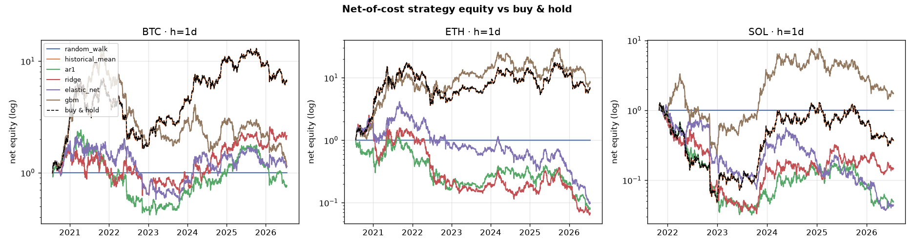
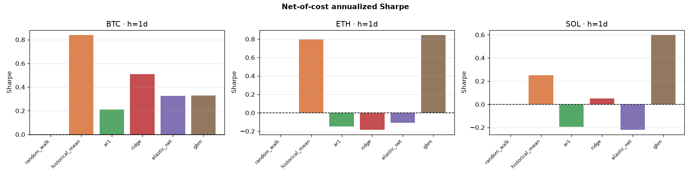
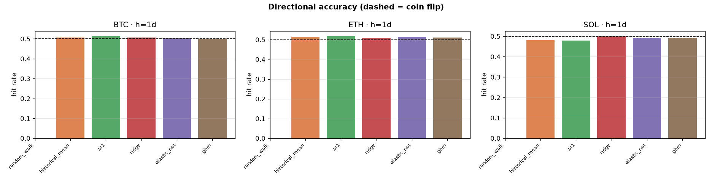

# Out-of-sample results

_Generated by `make backtest` on 2026-07-18 — do not edit by hand._

**Study.** Assets BTC, ETH, SOL; horizons 1d, 7d; period 2019-01-01→today. Walk-forward: expanding, train 504d / test 63d, embargo 5d. Costs: 17 bps per side.

## Headline: does anything beat the random walk?

- Of **18** ML (model x asset x horizon) settings, **0** beat the random walk on squared error at p<0.05 (Diebold-Mariano), and **0** showed significant sign-timing skill at p<0.05 (Pesaran-Timmermann).
- After costs, **1** ML strategies had a net Sharpe whose 95% bootstrap CI excluded zero.
- Best deflated Sharpe (guarding against the 6-way model search): **0.87** (historical_mean, BTC, h=1).

## Forecast accuracy & market timing

`R²_oos` is out-of-sample R² vs the mean (negative = worse than predicting the mean). `DM p` tests equal squared-error accuracy vs the random walk; `PT p` tests sign predictability.

**BTC · h=1d**

| model | RMSE | R²_oos | DirAcc | RankIC | DM p vs RW | PT p |
| --- | --- | --- | --- | --- | --- | --- |
| random_walk | 0.0301 | -0.0008 | — | — | — | — |
| historical_mean | 0.0301 | -0.0014 | 0.506 | 0.002 | 0.860 | — |
| ar1 | 0.0301 | -0.0026 | 0.513 | 0.033 | 0.737 | 0.214 |
| ridge | 0.0302 | -0.0093 | 0.506 | 0.049 | 0.447 | 0.609 |
| elastic_net | 0.0301 | 0.0017 | 0.505 | 0.046 | 0.644 | 0.806 |
| gbm | 0.0301 | -0.0015 | 0.501 | 0.028 | 0.904 | 0.728 |

**BTC · h=7d**

| model | RMSE | R²_oos | DirAcc | RankIC | DM p vs RW | PT p |
| --- | --- | --- | --- | --- | --- | --- |
| random_walk | 0.0804 | -0.0049 | — | — | — | — |
| historical_mean | 0.0807 | -0.0122 | 0.529 | -0.018 | 0.686 | — |
| ar1 | 0.0807 | -0.0124 | 0.529 | -0.023 | 0.675 | — |
| ridge | 0.0825 | -0.0594 | 0.523 | 0.044 | 0.064 | 0.159 |
| elastic_net | 0.0817 | -0.0383 | 0.523 | 0.043 | 0.153 | 0.217 |
| gbm | 0.0812 | -0.0261 | 0.530 | 0.003 | 0.352 | 0.246 |

**ETH · h=1d**

| model | RMSE | R²_oos | DirAcc | RankIC | DM p vs RW | PT p |
| --- | --- | --- | --- | --- | --- | --- |
| random_walk | 0.0407 | -0.0005 | — | — | — | — |
| historical_mean | 0.0407 | -0.0011 | 0.515 | 0.019 | 0.806 | — |
| ar1 | 0.0408 | -0.0030 | 0.517 | 0.036 | 0.639 | 0.340 |
| ridge | 0.0411 | -0.0178 | 0.509 | 0.053 | 0.157 | 0.588 |
| elastic_net | 0.0409 | -0.0062 | 0.515 | 0.040 | 0.413 | 0.308 |
| gbm | 0.0408 | -0.0018 | 0.510 | 0.020 | 0.806 | 0.551 |

**ETH · h=7d**

| model | RMSE | R²_oos | DirAcc | RankIC | DM p vs RW | PT p |
| --- | --- | --- | --- | --- | --- | --- |
| random_walk | 0.1073 | -0.0024 | — | — | — | — |
| historical_mean | 0.1076 | -0.0082 | 0.514 | 0.039 | 0.697 | — |
| ar1 | 0.1076 | -0.0084 | 0.514 | 0.033 | 0.686 | — |
| ridge | 0.1123 | -0.0997 | 0.476 | -0.047 | 0.002 | 0.001 |
| elastic_net | 0.1115 | -0.0837 | 0.479 | -0.052 | 0.003 | 0.001 |
| gbm | 0.1081 | -0.0184 | 0.517 | -0.033 | 0.295 | 0.352 |

**SOL · h=1d**

| model | RMSE | R²_oos | DirAcc | RankIC | DM p vs RW | PT p |
| --- | --- | --- | --- | --- | --- | --- |
| random_walk | 0.0498 | -0.0001 | — | — | — | — |
| historical_mean | 0.0502 | -0.0156 | 0.481 | -0.029 | 0.003 | — |
| ar1 | 0.0504 | -0.0220 | 0.478 | -0.007 | 0.017 | 0.415 |
| ridge | 0.0509 | -0.0422 | 0.500 | 0.010 | 0.036 | 0.977 |
| elastic_net | 0.0504 | -0.0238 | 0.491 | 0.013 | 0.119 | 0.522 |
| gbm | 0.0504 | -0.0210 | 0.491 | 0.020 | 0.077 | 0.447 |

**SOL · h=7d**

| model | RMSE | R²_oos | DirAcc | RankIC | DM p vs RW | PT p |
| --- | --- | --- | --- | --- | --- | --- |
| random_walk | 0.1345 | -0.0012 | — | — | — | — |
| historical_mean | 0.1420 | -0.1153 | 0.467 | -0.103 | 0.000 | — |
| ar1 | 0.1419 | -0.1145 | 0.467 | -0.098 | 0.000 | — |
| ridge | 0.1449 | -0.1617 | 0.476 | -0.039 | 0.001 | 0.083 |
| elastic_net | 0.1435 | -0.1387 | 0.491 | -0.034 | 0.001 | 0.649 |
| gbm | 0.1444 | -0.1540 | 0.472 | -0.060 | 0.001 | 0.634 |

## Net-of-cost trading performance

Sign strategy on a non-overlapping h-day schedule, after 17 bps/side. `Sharpe` is annualized with a 95% circular-block-bootstrap CI; `PSR`/`DSR` are the probabilistic and deflated Sharpe ratios (DSR corrects for trying several models).

**BTC · h=1d**

| model | Sharpe (net) | 95% CI | MaxDD | PSR | DSR | trades |
| --- | --- | --- | --- | --- | --- | --- |
| random_walk | 0.00 | [0.00, 0.00] | 0.00% | — | — | 0 |
| historical_mean | 0.84 | [0.01, 1.61] | -76.63% | 0.98 | 0.87 | 1 |
| ar1 | 0.21 | [-0.51, 0.90] | -82.75% | 0.70 | 0.35 | 487 |
| ridge | 0.51 | [-0.18, 1.23] | -65.69% | 0.89 | 0.63 | 496 |
| elastic_net | 0.33 | [-0.35, 1.02] | -74.28% | 0.79 | 0.46 | 539 |
| gbm | 0.33 | [-0.47, 1.13] | -90.65% | 0.79 | 0.46 | 233 |

**BTC · h=7d**

| model | Sharpe (net) | 95% CI | MaxDD | PSR | DSR | trades |
| --- | --- | --- | --- | --- | --- | --- |
| random_walk | 0.00 | [0.00, 0.00] | 0.00% | — | — | 0 |
| historical_mean | 0.80 | [-0.12, 1.63] | -75.94% | 0.98 | 0.85 | 1 |
| ar1 | 0.80 | [-0.12, 1.63] | -75.94% | 0.98 | 0.85 | 1 |
| ridge | 0.57 | [-0.27, 1.44] | -78.54% | 0.92 | 0.68 | 106 |
| elastic_net | 0.51 | [-0.54, 1.55] | -86.14% | 0.90 | 0.62 | 92 |
| gbm | 0.65 | [-0.26, 1.55] | -67.93% | 0.95 | 0.75 | 29 |

**ETH · h=1d**

| model | Sharpe (net) | 95% CI | MaxDD | PSR | DSR | trades |
| --- | --- | --- | --- | --- | --- | --- |
| random_walk | 0.00 | [0.00, 0.00] | 0.00% | — | — | 0 |
| historical_mean | 0.80 | [-0.02, 1.57] | -79.35% | 0.97 | 0.66 | 1 |
| ar1 | -0.15 | [-0.96, 0.57] | -93.65% | 0.36 | 0.03 | 666 |
| ridge | -0.18 | [-0.90, 0.61] | -97.49% | 0.33 | 0.02 | 607 |
| elastic_net | -0.11 | [-0.84, 0.64] | -97.71% | 0.39 | 0.04 | 723 |
| gbm | 0.84 | [-0.00, 1.61] | -75.78% | 0.98 | 0.70 | 173 |

**ETH · h=7d**

| model | Sharpe (net) | 95% CI | MaxDD | PSR | DSR | trades |
| --- | --- | --- | --- | --- | --- | --- |
| random_walk | 0.00 | [0.00, 0.00] | 0.00% | — | — | 0 |
| historical_mean | 0.76 | [-0.09, 1.56] | -77.32% | 0.97 | 0.61 | 1 |
| ar1 | 0.76 | [-0.09, 1.56] | -77.32% | 0.97 | 0.61 | 1 |
| ridge | -0.11 | [-0.98, 0.81] | -99.18% | 0.40 | 0.03 | 71 |
| elastic_net | -0.13 | [-0.95, 0.72] | -98.89% | 0.38 | 0.03 | 55 |
| gbm | 0.96 | [0.06, 1.78] | -82.37% | 0.99 | 0.78 | 31 |

**SOL · h=1d**

| model | Sharpe (net) | 95% CI | MaxDD | PSR | DSR | trades |
| --- | --- | --- | --- | --- | --- | --- |
| random_walk | 0.00 | [0.00, 0.00] | 0.00% | — | — | 0 |
| historical_mean | 0.25 | [-0.63, 1.13] | -96.27% | 0.71 | 0.38 | 1 |
| ar1 | -0.19 | [-1.01, 0.67] | -97.51% | 0.34 | 0.10 | 143 |
| ridge | 0.05 | [-0.89, 0.82] | -97.41% | 0.54 | 0.22 | 376 |
| elastic_net | -0.22 | [-1.21, 0.63] | -97.11% | 0.32 | 0.09 | 406 |
| gbm | 0.60 | [-0.32, 1.42] | -92.94% | 0.90 | 0.67 | 83 |

**SOL · h=7d**

| model | Sharpe (net) | 95% CI | MaxDD | PSR | DSR | trades |
| --- | --- | --- | --- | --- | --- | --- |
| random_walk | 0.00 | [0.00, 0.00] | 0.00% | — | — | 0 |
| historical_mean | 0.23 | [-0.75, 1.09] | -95.88% | 0.69 | 0.42 | 1 |
| ar1 | 0.23 | [-0.75, 1.09] | -95.88% | 0.69 | 0.42 | 1 |
| ridge | 0.45 | [-0.43, 1.23] | -89.67% | 0.84 | 0.61 | 72 |
| elastic_net | 0.60 | [-0.19, 1.35] | -83.94% | 0.91 | 0.73 | 62 |
| gbm | -0.03 | [-0.90, 0.73] | -96.38% | 0.47 | 0.22 | 27 |

## Figures

